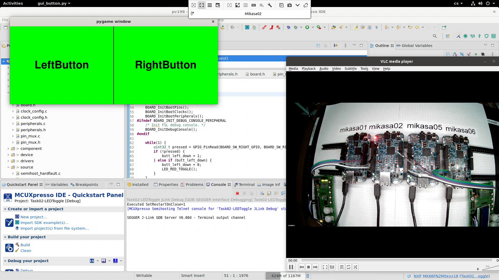

# Experience with Remote Teaching of Embedded Systems


In 2020, we had to abruptly prepare an online version of a hardware-related course at our university.
This happened in a few weeks, in which we prepared an online alternative.

This repository described the implementation details of how our remote education platform was prepared.
More details on the experience and how it turned out in the article itself: https://doi.org/10.1145/3502718.3524821
The course teaches basic software skills for embedded development: programming of ARM microcontrollers.
Students would work with development boards at our laboratory during the in-person semester.

In the online version, the hardware kits are connected to computers permanently, and students can program them remotely via remote desktop and webcam.
The seminars were online on the Discord platform, taught similarly to traditional semesters.

The solution is a cluster of hypervisors, where each hypervisor contains two virtual machines that serve as a workstation.
Each student logged remotely into one workstation during the semester and worked from there.
From the perspective of the student, the setup looked like this:




In the end, the system worked well enough and showed some benefits over the on-place teaching.
However, the most crucial thing was that we managed to do that without a complex development, primarily by using existing tools.
The system will not be used anymore, but we want to re-create it again if another pandemic or similar event hits us again.

# Table of Contents

* [Prerequisities](#prerequisities)
* [Repository](#repository)
* [Prepare Ansible](#prepare-ansible)
* [Prepare hypervizors](#prepare-hypervizors)
* [Prepare first virtual machine](#prepare-first-virtual-machine)
* [Shared playbook](#shared-playbook)
   * [Hostname](#hostname)
   * [Disable password root login](#disable-password-root-login)
   * [Dynamic to static ip](#dynamic-to-static-ip)
   * [Load ssh keys](#load-ssh-keys)
   * [Deploy](#deploy)
* [Hypervizors](#hypervizors)
   * [Specific packages](#specific-packages)
   * [Enable avahi](#enable-avahi)
   * [Enable libvirt](#enable-libvirt)
   * [USB hotplug](#usb-hotplug)
   * [udev](#udev)
   * [Virtual images](#virtual-images)
   * [Deploy](#deploy-1)
* [Virtuals](#virtuals)
   * [Packages](#packages)
   * [xrdp](#xrdp)
   * [LDAP](#ldap)
   * [Add users](#add-users)
   * [NFS](#nfs)
* [Webcams](#webcams)
   * [Motion](#motion)
* [Sion](#sion)
* [Access control](#access-control)


# Prerequisities

We used six computers that we could completely reinstall and prepared a "remote table" at our laboratory.
There were four webcams and twelve development kits at the beginning.
The computers were connected to a single network, which was routed by our server.

It was crucial that the setup had its own place and was not disturbed.
During the semester, we found out that the fact that teachers were present in the room during the course was really beneficial - they could tackle some issues directly on the hardware.

We used Ansible as a primary tool to set up the cluster.
Apart from place and hardware, the only thing necessary for the setup is the admins laptop with Ansible installed.

# Repository

The configuration of the cluster was stored in a git repository shared between the teachers.
This way, any teachers could work with the cluster, and we got the much-appreciated history of changes.

The first step of replication is to create a repository.
For the rest of the manual, we assume that `./` refers to the repository's root folder.

# Prepare Ansible

Ansible supports a wide range of configuration storage and preparation of complex setups.
We decided to use a simple approach that is non-standard but much easier to use.
The basic principle was that each machine of the cluster and its configuration (that is, machine-specific variables) are stored in one file for an easier overview of the entire setup.

We decided to use ansible with YAML inventory, making it possible to list multiple groups of machines in the inventory with their variables and configuration.
Create a file `./inventory/static_inventory.yml` with default content:

```yaml
hypervizors:
  hosts:
virtuals:
  hosts:
```

That tells Ansible that there are two groups of machines we will take care of - hypervisors and virtuals.
We also have to create Ansible config file that tells it to use yaml inventory named `./ansible.cfg`:

```
[defaults]
inventory = inventory
forks = 30

[inventory]
enable_plugins = host_list, auto, nmap, yaml
cache = yes
cache_connection = /tmp/Ansible_inventory
```

# Prepare hypervizors

Manually install Ubuntu 20.04 on each machine used in the cluster as a hypervisor.
Add your user and enable ssh daemon.
Login remotely to test it and set up key-based authentication.
We preferred to log directly as the root user.

Once you verify that you can access the machine, log its name and address into Ansible inventory.
We have to add an item for each machine under the `hosts:` key of the `hypervisors` group.
We tell Ansible the IP address of each machine and use root directly.

```yaml
hypervizors:
  hosts:
    yeager01:
      Ansible_host: 192.168.1.2
      Ansible_user: root
    yeager02:
      Ansible_host: 192.168.1.3
      Ansible_user: root
```

Repeat this for each hypervisor you want in your setup.
There is a possibility to avoid repeated manual installation either with disk cloning or network installation.
We did it manually as it was the faster way for just seven machines.
We used `yeager` as a name for hypervisors indexed by a number.

After that you have logged each hypervisor into the inventory, use some simple Ansible command to test that you can reach all of them:

```bash
Ansible all -m ping
```
Select one hypervisor and manually install libvirt.
Install virt-manager on your laptop and connect it to that hypervisor.

# Prepare first virtual machine

We knew that we couldn't automatize everything for the virtual machines. Hence we decided to create the first one manually - it serves as a template.
We used `Mikasa` as the basename for the virtual machines. The template one is called `mikasaXX`.
(It pays off to have easy to remember the handy name for each type of machine, simplifies communication between teachers)

Use the virt-manager to create the virtual machine on the hypervisor.
The setup is similar to hypervisors: Install Ubuntu 20.04, add user, enable ssh for root and copy your ssh key.
Think about what would be too problematic to automatize and do that now.
In our case, that was the installation of development IDE for the used microcontroller - MCUXpresso IDE.
Shut down the virtual machine.

We need to create to pack the machine to be distributed from administrators pc.
Libvirt uses two files that define the virtual machine:
 1. definition: `/var/lib/libvirt/mikasaXX.xml`
 2. disk: `/var/lib/libvirt/images/mikasaXX.qcow2`

Copy both of them from the hypervisor into your local computer into the repository folder `./files/`.
We assume that any extra files used will be in that folder for the rest of the manual.

Note: we did not store the disk file in the repository as it was pretty big. Once it was distributed across hypervisors, we simply ignored that we missed it.

# Shared playbook

We have prepared hypervisors and virtual machine, so it is time to write the first Ansible playbook.
Traditional Ansible has a more complex abstraction to set up machines - roles.
We did not use that and preferred just to prepare simple playbooks - YAML files that define what should be done on the targeted machine.

Create a playbook file: `./shared.yml`
With content:

```yaml
---
- name: shared playbook
  hosts: virtuals, hypervizors

  tasks:
```

This playbook contains configuration that is shared between the hypervisors and virtual machines.
The default content above tells it that it should be executed on both virtuals and hypervisors groups of machines, and then there is empty tasks list.

## Hostname

When we prepared the machines, we enabled ssh and gave ourselves access.
The first step was to change each machine's hostname based on its name in the Ansible inventory.
It is necessary for communication between humans to know the _name_ of the computer one interacts with.

To do that, we add the following task into the `./shared.yml` playbook, so it looks like this:

```yaml
---
- name: shared playbook
  hosts: virtuals, hypervizors

  tasks:
    - hostname:
         name: "{{ inventory_hostname }}"
```

This way, we tell Ansible to set up the hostname to the key value of the said machine in inventory.
(yeager01, yeager02 in the example)

## Disable password root login

To be sure that the ssh access is done correctly, we made a rule to disable the root password explicitly.
That is, any login into machines was made with ssh keys.
That was done manually anyway. However, we felt that it is necessary to ensure that it is the case on every machine.

Add this task:
```yaml
    - name: Disable password root login
      lineinfile:
        dest: /etc/ssh/sshd_config
        regexp: '^#?PermitRootLogin'
        line: 'PermitRootLogin without-password'
```

## Dynamic to static ip

The machines network has a DHCP server that assigns dynamic addresses to the devices.
To reduce the potential for mismatches in configuration, we decided to switch all the dynamic addresses the machines got into their static IP addresses.
While not a proper way of doing it, this can be done by writing tasks that just execute appropriate commands on the machine.

Add this task:
```yaml
    - name: Setup static IP
      shell: |
        nmcli con mod "Wired connection 1" ipv4.method manual

        nmcli con mod "Wired connection 1" ipv4.addresses {{Ansible_host}}/24

        nmcli con mod "Wired connection 1" ipv4.gateway 192.168.1.1

        nmcli con mod "Wired connection 1" ipv4.dns "8.8.8.8"
```

## Load ssh keys

We collected the ssh keys of teachers and automatically distributed them everywhere.
The system must be prepared in a way that it is not tied to one person.
However, there was only one additional teacher with the necessary skills, so the task only deployed one key.

Create a folder `./files/keys/`, and store their additional ssh keys.
Add this task:

```yaml
    - name: Copy extra key
      authorized_key:
        user: root
        state: present
        key: "{{ lookup('file', './files/keys/extra.pub') }}"
```

## Deploy

The playbook is executed by writing:
```bash
Ansible-playbook ./shared.yml
```
The example file is also present in this repository as `./shared.yml`.

So far, this only activates the shared configuration only on hypervisors, as only they are present in the inventory.
As a matter of habit, we rebooted each hypervisor at this point and checked again that Ansible works just fine - that it can connect to each machine.

```bash
ansible hypervizors -a "/sbin/reboot"
```

# Hypervizors

We have prepared the hypervisors, and the shared configuration is active. Let's prepare a hypervisor-specific configuration.

This is written in a separate playbook: `./hypervizors.yaml`
The header of this playbook should look like this:

```yml
---
- name: setup hypervizors
  hosts: hypervizors

  tasks:
```

## Specific packages

The first step is to install all non-default packages required, including a list of utilities that we prefer and the virtualization software.

To do that, add this task:
```yml
    - name: Install packages
      apt:
        name: [vim, git, tree, libvirt-daemon, qemu-kvm, libvirt-daemon-system, tmux, avahi-daemon, avahi-utils, avahi-dnsconfd]
        state: latest
```

## Enable avahi

As another way to relieve the dependence on IP addresses, we have good experience with avahi.
It enables machines to find themselves on the network based on the hostname broadcasted by avahi-daemon.
This was configured, but we did not use it in the end. (So you can skip this)

To enable avahi, add this task (not that it was installed in the previous step):
```yml
    - name: Enable avahi
      systemd:
        name: avahi-daemon
        enabled: yes
        state: started
```

## Enable libvirt

Enable the libvirt virtualization deamon, including starting it immediately.

Add this task:
```yml
    - name: Enable virtualization
      systemd:
        name: libvirtd
        enabled: yes
        state: started
```
## USB hotplug

Each virtual machine will use some USB devices, and they usually have to be assigned manually in the GUI of the virtualization software.
That would not scale in our case, as we had to disconnect/connect the development boards periodically.

This, however, can be automatized, as `libvirt` has a command-line utility to work with it - `virsh`.
The downside is that there is no command to assign the device directly.
What has to be done is to generate a .xml file with the assignment definition and give that to the `virsh` tool.
We prepared a set of bash scripts, that based on arguments did that - `./files/hotplug_add.sh` and `./files/hotplug_remove.sh`.
They generated the xml files and inserted them into `virsh`.

To upload the scripts into the hypervisors, add this task:
```yml
    - name: Copy udev scripts
      copy:
        src: './files/{{item}}'
        dest: '/root/{{item}}'
        mode: a+x
      loop:
        - "hotplug_add.sh"
        - "hotplug_remove.sh"
```

## udev

The USB scripts were executed by `udev` once anything was connected/disconnected from the USB ports of hypervisors.
Each hypervisor had two columns of USB ports on itself.
We used one column of the ports for each virtual machine (that was handy for the teachers, as it was mentally easy to figure out which ports belong to which virtual).

One of the caveats is that the id of the ports for `udev` was not identical between the hypervisors, even thou they have the same hardware.
That means that we had to create configuration variables in the inventory and do the manual mapping.

We added the configuration variable `usb_bind` for each hypervisor, which contained the mapping of USB port ids to a virtual machine:
```yaml
    yeager01:
      Ansible_host: 192.168.50.109
      Ansible_user: root
      usb_bind:
        - { kernel: "3-2", bind_to: mikasa01 }
        - { kernel: "3-1", bind_to: mikasa01 }
        - { kernel: "1-1.4", bind_to: mikasa02 }
        - { kernel: "1-1.2", bind_to: mikasa02 }
```

Once the mapping was done in inventory for each hypervisor, we moved to prepare the udev configuration.
That is generated by Ansible templating system, it will take a file template and generate the output file based on variables specific to that hypervisor.
You can see that the template file `files/udev.rules.j2` uses special syntax and refers to the variables we specified for each hypervisor.

To deploy the udev config, add this task:
```yaml
    - name: Copy udev rules
      template:
        src: files/udev.rules.j2
        dest: /etc/udev/rules.d/80-udev.rules
```

We also added a task to always force the restart of udev:
```yaml
    - name: Reset udev
      systemd:
        name: udev
        state: restarted
```

## Virtual images

We assume that you have the definition of the template for virtual machines in `./files/mikasaXX.xml`, and the disk file is in `./files/mikasaXX.qcow2`.
Now we will copy both files to the exact location on the original machine.
This will take a while as the virtual machine disk is not small, but Ansible will not re-upload the file unless it changes - it will happen only once.

Just copying the files is not enough. Libvirt has to be notified of them.
To make sure that happens reliably, we made the mechanics silently un-register the virtual machine and then register it again.
Keep in mind that this only distributes and registers only the template virtual machine on each hypervisor.
This does not produce the final virtual machines.

Add these tasks:
```yaml
    - name: Copy base virtual image
      copy:
        src: files/mikasaXX.qcow2
        dest: /var/lib/libvirt/images/mikasaXX.qcow2
        owner: libvirt-qemu
        group: kvm
    - name: Copy base virtual def
      copy:
        src: files/mikasaXX.xml
        dest: /var/lib/libvirt/mikasaXX.xml
    - name: Undefine base virtual
      shell: virsh undefine mikasaXX
      ignore_errors: yes
    - name: Define base virtual
      shell: virsh define /var/lib/libvirt/mikasaXX.xml
```

## Deploy

Once again, we just execute the playbook over all hypervisors:
```bash
ansible-playbook ./hypervizors.yml
```

This will probably take some time once it arrives on copying the virtual machines, but other than that, it is fast enough.
We again suggest rebooting the machines and manually checking that everything is fine and Ansible can still connect to all of them.
At this step, we also suggest that you manually add a connection to each hypervisor into the virt-manager on the administrator's pc.

# Virtuals

Each hypervisor should contain the base template image for virtual machines.
We manually copied the template machine with the virt-manager tool.
This could be automatized, but we decided to avoid that as it seemed faster to do it manually.

The `yeagers` had names that ended with `01` to `07`.
The numbering was `01` to `14` for the virtual machines.
We decided to create a scheme where Yeager `x` as mikasas `2*x` and `2*x+1`.
This rule benefited us in the long run, as it was mentally easy to guess which Yeager each Mikasa is.

Once the mikasas are copied, you should manually start each of them.
Now you should manually open each Mikasa and get its assigned ipv4 address, and prepare another group of machines in inventory with mikasas by adding the hosts:

```yaml
virtuals:
  hosts:
    mikasa01:
      Ansible_host: 192.168.1.80
      Ansible_user: root
    mikasa02:
      Ansible_host: 192.168.1.81
      Ansible_user: root
```

Do not forget to execute the shared playbook again. This time it should also affect all the mikasas.
You can use this as a step to verify that all of them are prepared correctly.

Once again, prepare a new and clean playbook for virtual machines `./virtuals.yml`, with content:

```yaml
---
- name: setup virtuals
  hosts: virtuals
  vars_files:
    - vars/students.yml
  handlers:
    - name: register_certificate
      shell: |
        mkdir -p /etc/ldap/certs/
        openssl x509 -in /root/CA.crt -out /etc/ldap/certs/CA.pem -inform DER -outform PEM
        chmod u=rw,g=r,o=r /etc/ldap/certs/CA.pem
        chown root:root /etc/ldap/certs/CA.pem
  tasks:
```

This time the header of the playbook is more complex as we used more things:
 1. `vars/students.yml` file - this file contained a list of students in the course used by the tasks
 2. `handlers` - are a special type of tasks that do not typically execute, only after they are triggered. Here we have one such task - for registration of a certificate for LDAP.

## Packages

We installed a specific set of packages for the virtual machines.
Note the python packages. These were necessary for some of our scripts lately used.

Add this task:
```yaml
    - name: Install packages
      apt:
        name: [vim, git, tree, xrdp, screen, htop, glances, screen, dbus, libnm-dev, network-manager, python3-dbus, python-gi, nscd, libnss-ldap, ldap-utils, python3, python3-serial, python3-pygame]
        state: latest
```

## xrdp

We used `xrdp` as a remote access daemon. This was the main access point for the students to the machine.
This daemon implements the available/known RDP protocol.

The daemon is enabled with:
```yaml
    - name: Enable xrdp
      systemd:
        name: xrdp
        enabled: yes
        state: started
```

For this to be error-less, we also have to add a configuration file for polikt:
```yaml
    - name: Copy polkit settings
      copy:
        src: ./files/02-allow-colord.conf
        dest:  /etc/polkit-1/localauthority.conf.d/02-allow-colord.conf
        owner: root
        mode: 644
```
And give xrdp access to read ssl certificates:
```yaml
    - name: Add xrdp to ssl-cert group
      user:
        name: xrdp
        groups: ssl-cert
        append: yes
```

## LDAP

Our faculty provides authentication service in the form of an LDAP server.
This way, we could prepare the virtual machines in a way that students would use the accounts that they usually use.
This is deeply faculty-specific.
There are fives tasks required:
1. Download of certificate of the faculty that triggers the `register_certifiace` task
2. Copy LDAP configuration
3. Copy extra LDAP configuration
4. Enable LDAP as a method to get information about the user in nsswitch
5. Enable LDAP as a method to get information about the group in nsswitch

Note that the configuration files were redacted and are not functional.

```yaml
    - name: Get FI cert
      get_url:
        url: https://faculty.website/CA.crt
        dest: /root/CA.crt
      notify:
        - register_certificate
    - name: Copy ldap.conf
      copy:
        src: ./files/ldap.conf
        dest: /etc/ldap.conf
    - name: Copy ldap/ldap.conf
      copy:
        src: ./files/ldap2.conf
        dest: /etc/ldap/ldap.conf
   - name: Setup nsswitch - passwd
      lineinfile:
        path: /etc/nsswitch.conf
        regexp: '^passwd'
        line: "passwd:         compat systemd ldap"
    - name: Setup nsswitch - group
      lineinfile:
        path: /etc/nsswitch.conf
        regexp: '^group'
        line: "group:          compat systemd ldap"
```

## Add users


We were able to set up the LDAP to handle login authentication, but we struggled to prepare the automatic creation of a local account once the user logged in.
Given limited time (and faculty stuff was also quite busy), we decided to use an alternative solution.
We exported a list of course students from our IS and stored that as a file in Ansible.
We then added a simple Ansible rule to add users that used that file.
That means that we created an account "manually" for each student on each computer.

To do that, we use the `vars/students.yml` file and this task:
```yaml
    - name: Add students
      user:
        name: "{{item}}"
        groups: dialout
        append: yes
        shell: /bin/bash
```


## NFS

Another service that our faculty provides handy for the students is network storage.
The home folders on each faculty PC are shared between the machines.
Once students log in, their home directory is mounted from the network server (NFS).
This way, students have the same file system on each PC they use in our network.

We wanted to mirror that, as it would allow them to modify the files from different computers than just our virtual machines.
It would also mean that their files would not be locked to the virtual machine they created them at - they could share them between the workstations.
We, however, were not able to prepare that in time and skipped it.

# Webcams


We used webcams to give students a view of what the board was doing.
We ordered a webcam we had a good experience with and was not sold out in shops - Arducam IMX291.
The camera has a wide angle of view, so it was doable to prepare a setup when one camera could view four boards.
That means that three cameras would be enough for all twelve virtual machines.
We, however, decided to prepare one more as a backup.

The stream from the webcam was in FullHD over HTTP.
We wanted to use tools like jitsi for the stream, as compared to "simple webcam HTTP", because jitsi can dynamically change the quality of the stream based on the capabilities of the user's computer.
We did not manage to prepare that in time with jitsi, so we used plain old stream.

We selected three hypervisors to act as streaming machines in Ansible. This was done by making a subgroup in the hypervisors group:
```yaml
  children:
    cam_servers:
      hosts:
        yeager01:
```

Create a `webcams.yml` Ansible playbook with the following content:
```yml
---
- name: Setup webcams
  hosts: cam_servers
  tasks:
```

## Motion

We had good prior experience with motion software for the stream.
It is old Linux software for traditional security cameras.
However, once configured correctly, it can serve as a USB stream web camera software.
Once the configuration was prepared, it was just copied, and the daemon was started/enabled.

The tasks are:
```yaml
    - name: install
      apt:
        name: [motion]
        state: latest
    - name: copy config
      copy:
        src: ./files/motion.conf
        dest: /etc/motion/motion.conf
    - name: copy def
      copy:
        src: ./files/def_motion
        dest: /etc/default/motion
    - name: start
      systemd:
        name: motion
        state: restarted
        enabled: yes
```

# Sion

The network is behind our laboratories server - sion.
The server provides NAT - the virtual machines are not accessible by default from WAN, nor are the webcameras.
Given our faculty's network rules, we discussed how to approach this with our faculty administrators.
`sion` is normally visible from the internet, but we use a faculty firewall to block anything except for 22/88/443 ports.

After discussion, they agreed to change the firewall rules so that port range X...Y is also accessible, but only from VPN of our faculty.
We agreed that we would port forward ports from that range to virtual machines/webcams and force students to access it with the VPN.
We used separate Ansible to configure the firewall on `sion` to prepare the port forwarding.
Due to internal reasons, this part is not shareable.

# Access control

There was no access control for the virtual machines.
That is, anybody could log anywhere at any time.
We thought about limiting. Mainly, we thought about making sure that only one student could be logged at each machine during lecture time.
We also wanted to filter that so that only students from the group of that seminar could be logged in.
We did not realize any solution due to limited time and just decided to trust the students to behave sensibly.
Luckily, we did not have any problems.